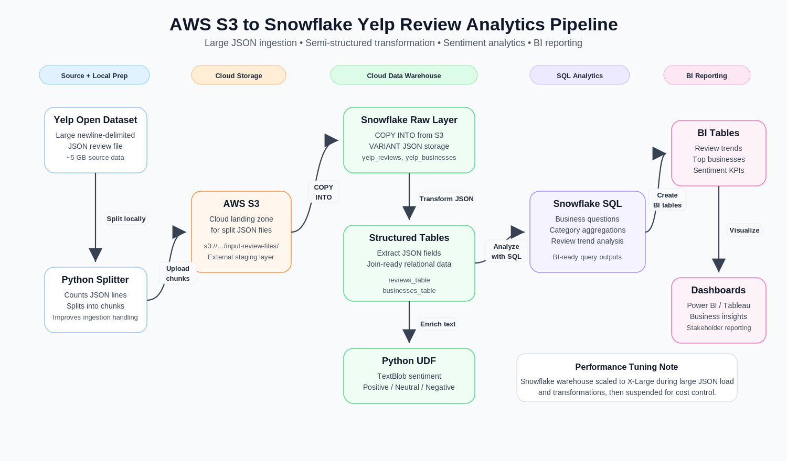

# BUSINESS REVIEW ANALYSIS
### End-to-End Data Pipeline: AWS S3 → Snowflake | Sentiment Analysis | Business Intelligence

**Link to downlaod the dataset**: https://business.yelp.com/data/resources/open-dataset/

## Overview

<!--
This project demonstrates an end-to-end cloud analytics pipeline using AWS S3, Snowflake, Alteryx, SQL, and Python UDFs. A large Yelp review JSON dataset was split into smaller files, staged in AWS S3, and ingested into Snowflake using semi-structured VARIANT tables. The raw JSON data was transformed into structured review and business tables, enriched with sentiment labels using a Snowflake Python UDF, validated through Alteryx workflows, and modeled into BI-ready datasets for review trends, category performance, user behavior, and business sentiment analysis.
-->

This project demonstrates an end-to-end cloud analytics pipeline using AWS S3, Snowflake, SQL, and Python UDFs. A large Yelp review JSON dataset was split into smaller files, staged in AWS S3, and ingested into Snowflake using semi-structured `VARIANT` tables. The raw JSON data was transformed into structured review and business tables, enriched with sentiment labels using a Snowflake Python UDF, and analyzed with SQL to generate BI-ready datasets for review trends, category performance, user behavior, and business sentiment analysis.

  

